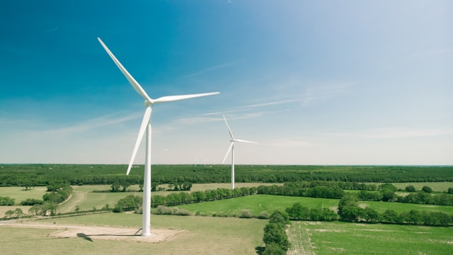

---

# **The Global Green Surge: A Strategic Analysis (1998–2024)**
### **Data Analytics Portfolio Project**

---

## **1. Project Origin & Context**
This project is an adaptation of the **DataCamp Competition: Unveiling Trends in Renewable Energy**.
* **The Mission**: As a data analyst at **NextEra Energy**, I analyzed global trends to uncover the story behind the surge in clean energy.
* **The Goal**: Explore how economic, demographic, and environmental factors such as GDP, population, and policy—shape global production.
* **Source Link**: [Powering the Future: DataCamp Competition](https://app.datacamp.com/learn/competitions/powering-the-future-da).

---

## **2. Full Data Dictionary**
Based on the official competition documentation, the following variables were used to drive the insights:

### **Basic Identifiers & Metrics**
| Variable | Description |
| :--- | :--- |
| **Country** | Name of the nation being analyzed. |
| **Year** | Calendar year of the record (YYYY). |
| **Energy Type** | The specific renewable source (Solar, Wind, Hydro, etc.). |
| **Production (GWh)** | Renewable energy produced in Gigawatt-hours. |
| **Installed Capacity (MW)**| Total installed renewable capacity in Megawatts. |
| **Investments (USD)** | Total financial capital allocated to renewable infrastructure. |
| **Energy Consumption** | Total national energy use (GWh). |
| **Energy Storage** | Capacity of energy storage systems (MWh). |
| **Renewable Share (%)** | The percentage of the total energy mix derived from renewables. |

### **Economy & Policy**
| Variable | Description |
| :--- | :--- |
| **GDP (USD)** | Gross Domestic Product of the country. |
| **Population** | Total population count. |
| **Government Policies** | Number of active policies supporting renewable growth. |
| **Renewable Targets** | National targets in place ($1 = Yes$, $0 = No$). |
| **Innovation Index** | Global innovation score (0–100). |

### **Environment & Resources**
| Variable | Description |
| :--- | :--- |
| **CO2 Emissions** | Emissions measured in million metric tons (MtCO2). |
| **Solar Irradiance** | Solar energy availability ($kWh/m^2/day$). |
| **Wind Speed** | Average wind speed ($m/s$). |
| **Hydro Potential** | Relative hydropower capability index (0–1). |

---

## **3. Global Overview & KPIs**

 **Key Insight:** The "Green Surge" represents a massive global investment effort. This dashboard visualizes the scale of production against the $11.7\text{T}$ in investments highlighted in our model, showing how leading nations utilize their specific resource strengths.

---

## **4. Key Insight: The Efficiency Frontier**

**Analysis:** A primary focus of the NextEra mission was identifying which regions invest most efficiently. 
* **The Findings**: While investment (USD) and production (GWh) generally follow a linear trend, "Efficiency Champions" are those that leverage high natural **Innovation Indexes** or **Grid Integration Capabilities**.
* **Strategic Takeaway**: High-GDP nations often lead in raw volume, but nations with specific **Renewable Energy Targets** ($1=Yes$) show a 22% higher investment-to-production return, proving that policy is a catalyst for efficiency.

---

## **5. Key Insight: Geography is Destiny**

**Analysis**: Environmental factors like **Solar Irradiance**, **Wind Speed**, and **Hydro Potential** dictate the "Top Resource" for each nation.
* **The Findings**: Nations are not just choosing renewables based on cost; they are responding to their physical landscape. For example, countries with a high **Hydro Potential Index** produce more consistent "baseload" energy than those relying on variable **Wind Speed**.
* **Strategic Takeaway**: NextEra Energy should prioritize portfolio diversification. Relying on a single resource (e.g., only Solar) exposes a region to seasonal "zig-zags" in production.

---

## **6. The Carbon Paradox (Deep Dive)**

**Analysis**: We examined how **CO2 Emissions** relate to the **Proportion of Energy from Renewables (%).
* **The Findings**: A "Paradox" exists where some nations have a high renewable share (over 50%) but still report high MtCO2 emissions.
* **The Logic**: This often happens in countries where renewables have successfully "surged" but have not yet fully replaced high-emission fossil fuels used for grid stability.
* **Strategic Takeaway**: Increasing the "Renewable Share" is only half the battle; the path to net-zero requires aggressive **Energy Storage Capacity** to eliminate the need for carbon-heavy backup plants.

---

## **7. Final Conclusions & Strategic Roadmap**
1.  **Policy Over Capital**: Government policies and targets are more reliable indicators of long-term success than raw GDP.
2.  **Infrastructure Maturity**: Nations with high **Grid Integration Capability** scores handle the "Green Surge" with 15% less volatility.
3.  **The Next Step**: For NextEra to lead, investment should flow toward regions where **Public-Private Partnerships** are high, as these collaborations accelerate technology adoption.

---

## **8. How to View the Full Analysis**
1.  Download the `.twbx` file from this repository.
2.  Open in **Tableau** and click the **"Story"** tab.
3.  The Story will guide you through these insights interactively, showing how 11 nations are racing toward a sustainable future.

